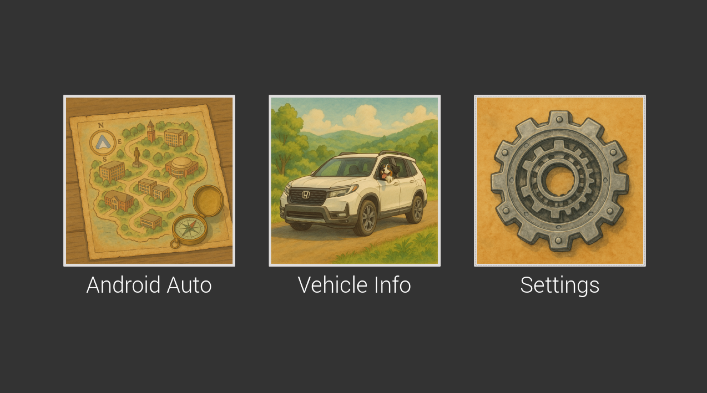
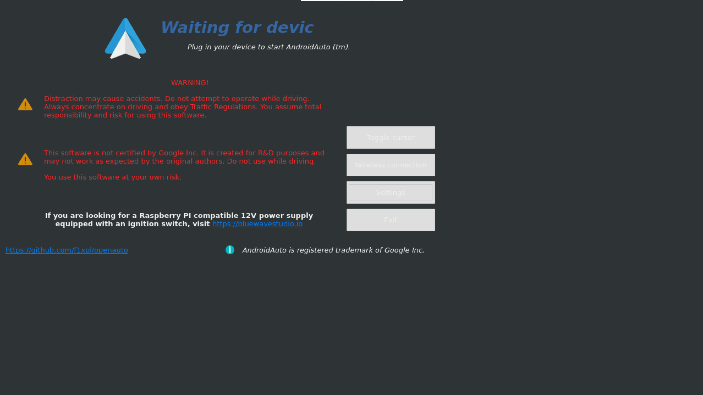
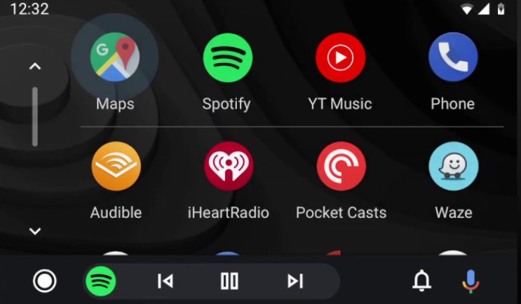
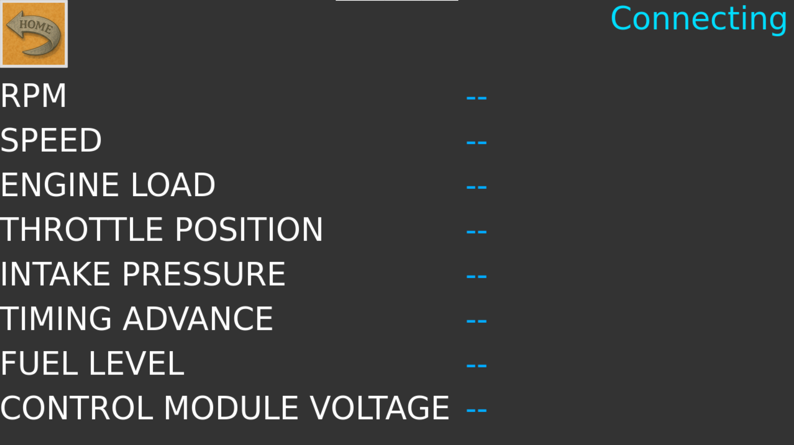
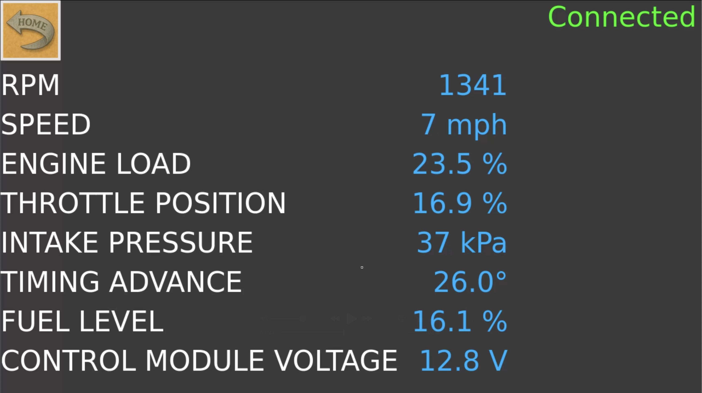
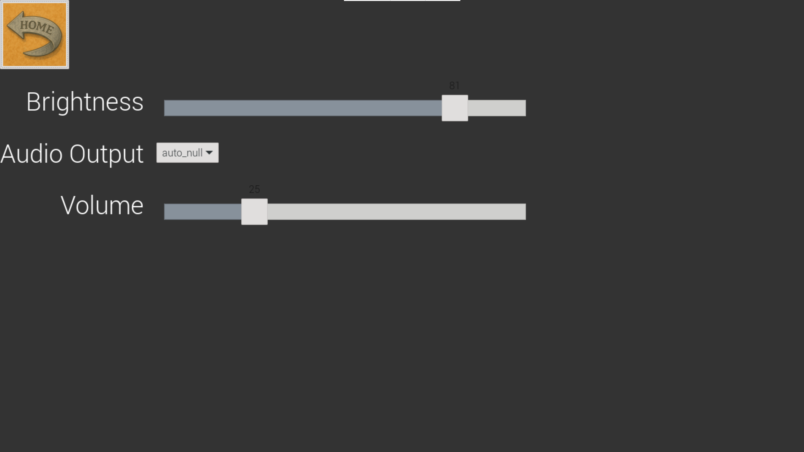

# Vroom
Infotainment using the Raspberry Pi 5. Has Android Auto and collects vehicle data using CANBUS from the OBDII port in cars. This was tested using Raspberry Pi OS (Debian 12 - Bookworm).

## Hardware:

* Raspberry Pi 5
* Rotary Encoder
* Raspberry Pi Touch Display 2
    * A Pin  - Connected to phsical pin 3
    * B Pin  - Connected to phsical pin 5
    * SW Pin - Connected to phsical pin 7

### How to use Rotary Encoder:

* Press SW to alternate between Brightness & Volume
* Rotating encoder CW will increase value (Brightness or Volume)
* Rotating encoder CCW will decrease value
* Inside Android Auto:
    * All previous functionality works
    * Press & Hold SW for 1s to exit Android Auto

## Interface:

### 1. Main Window

When the program is first launched you will be greeted with the following screen:

  

### 2. Android Auto (OpenAuto)

From the Main Window, if you pressed the "Android Auto" button, you will be greeted with the following screen:

  

Once your Android device has been recognized (currently setup for wired connection), you will be greeted with Android Auto:

  

### 3. Vehicle Information

From the Main Window, if you pressed the Vehicle Information button, you will be greeted with the following window:

  

Once you have successfully connected, you will be able to see some of your vehicle information.

  

### 4. Settings

When you press the settings button on the main window, you will be greeted with the following screen:

  

You can manually adjust the brighntess and volume using the touch screen (or the rotary encoder if you prefer).\
You also have the option to select different audio outputs that are already connected to the Pi.
