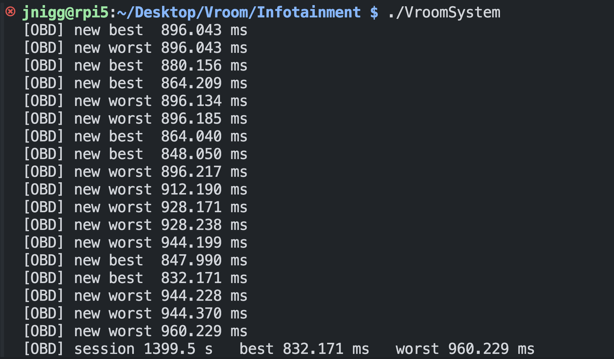

# System Report

## Architecure/Data Flow:

``` sql
|   main.c ─► MainWindow.c
            │
            │─► launches autoapp          (external Android-Auto process)
            │
            │─► opens SettingsWindow.c
            │        │
            │        │─► AudioManager.c         ── pactl ↔ PulseAudio
            │        │─► BacklightManager.c     ── writes /sys/class/backlight
            │        │─► RotaryEncoder.c        ── GPIO IRQ → g_idle callbacks
            │        │       ↑  (now IRQ-driven, no busy-poll)  ↑
            │
            └─► opens VehicleInfoWindow.c
                     │
                     └─► spawns scripts/obd_reader.py
                                └─► JSON frames 0.5 s ⟶ stdout ⟶ GTK pipe
``` 

RT tweak #1 - RotaryEncoder.c
* Switched from a timer based polling loop to edge triggered GPIO interrupts.
* The ISR pushes deltas into the GTK main loop with g_idle_add(), eliminating latency jitter and wasted CPU cycles.

RT tweak #2 - configuration constants
* All ```#define``` macros that were used for sample rates, buffer sizes, etc. were replaced with ```static const``` globals.
    * Wanted to get rid of globals as well, but they're accessed by different parts of the code. 
* This allows type checking, and makes run-time tuning easier without a full re-compile.

RT tweak #3 - Atomic Operation
* The helper Python file was set up using the Atomic Operations method from class.
* I made sure that the reader always got a whole JSON object.

RT tweak #4 - Modular Design
* The project was set up in a way where it would be easy to add functionality later.

## Vehicle Info Window:

### 1. The HANDSHAKE:

``` less
+---------------------------+               +-------------------------------+
|    VehicleInfoWindow.c    |    pipe       |          obd_reader.py        |
|     (GTK main thread)     | ───────────►  |        (helper process)       |
|                           |   stdout      |                               |
| • builds window           |               | • connects to ELM327 (@115 k) |
| • fork/exec helper        | ◄───────────  | • polls 8 PIDs                |
| • GIO watch on stdout     |   SIGCHLD     | • prints 1-line JSON / 0.5 s  |
| • parses JSON, repaints   |               |                               |
+---------------------------+               +-------------------------------+

```

### 2. The Python Helper Script:

```python
connection = obd.OBD(fast=False, baudrate=115200, timeout=1)

while True:
    frame = {}
    for key, cmd in PIDS.items():
        r = connection.query(cmd, force=True)        # blocking I/O
        if not r.is_null():
            v = r.value
            frame[key] = float(v.magnitude)
    print(json.dumps(frame), flush=True)             # atomic write
    time.sleep(0.5)                                  # throttle to 2 Hz
```

1. It prints one complete JSON object plus and calls ```flush=True()```
    * Gurantees everything is pushed down the pipe in one system call.
    * Atomic frame – one ```print()``` ≤ 200 B < ```PIPE_BUF```

2. Sleeps 0.5s
    * This allows it to stay within the typical OBD-II throughput
    * Fast enough for the GUI refresh
    * It prevents the pipe buffer from filling
    * It ensures that Python doesn't hog 100% of the CPUs resources

### 3. What the C code does:

``` C
g_spawn_async_with_pipes(NULL, argv, NULL,
        G_SPAWN_DO_NOT_REAP_CHILD | G_SPAWN_SEARCH_PATH,
        NULL, NULL,
        &ctx->pid,        /* <- child PID */
        NULL, &stdout_fd, /* we only care about stdout */ 
        NULL, NULL);


ctx->io  = g_io_channel_unix_new(stdout_fd);
g_io_add_watch(ctx->io, G_IO_IN | G_IO_HUP | G_IO_ERR, parse_line_cb, ctx);
```

* Event-driven – GLib ```poll()``` wakes only when bytes or ```HUP/ERR``` arrive. No busy-wait.

* Race-free – Widgets are modified exclusively inside ```parse_line_cb()```, which executes on the GTK thread.
    * Pipe writes are atomic, so there’s no need for locks or double-buffering.

## OBD-II Deadlines

The following shows how long it takes to gather the data coming in from the OBD-II port. \
You can subtract 0.5s from the time since there's a ```time.sleep(0.5)``` used to prevent overloading the bus.

<p align="center">
  
</p>

## Future Implementations:

Some ideas:
* Rewrite ```obd_reader.py``` and the entire ```OBD-II``` python library in C/C++ 
    * This will remove the Python interpreter latency
    * It will become easier to gurantee deadlines

* Off-load PID polling to a small MCU
    * The ECU bus will stay isolated
    * The Pi will recieve a steady UART stream, which should reduce the CPU load.

* Audio glitches under load
    * Pin PulseAudio to an isolated core
    * Rin it in ```SCHED_FIFO```
    * Could also replace it with a Jack + PREEMPT_RT path.

